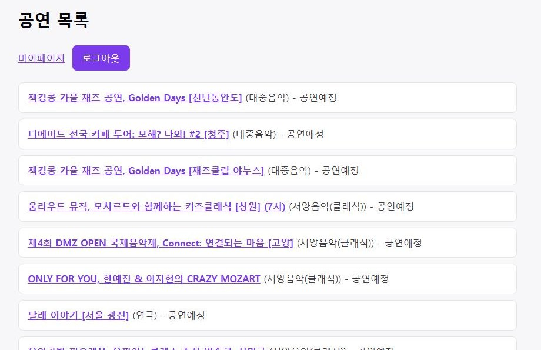
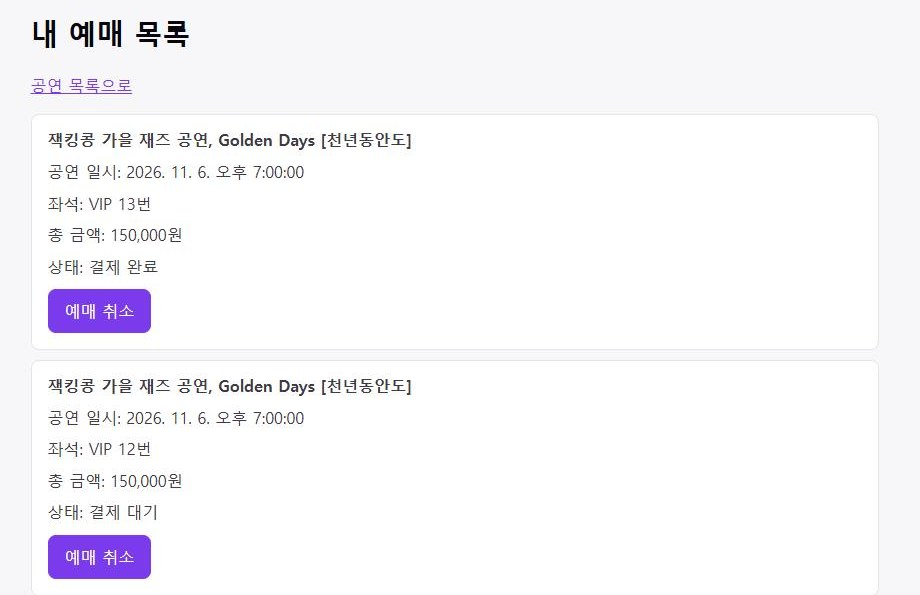
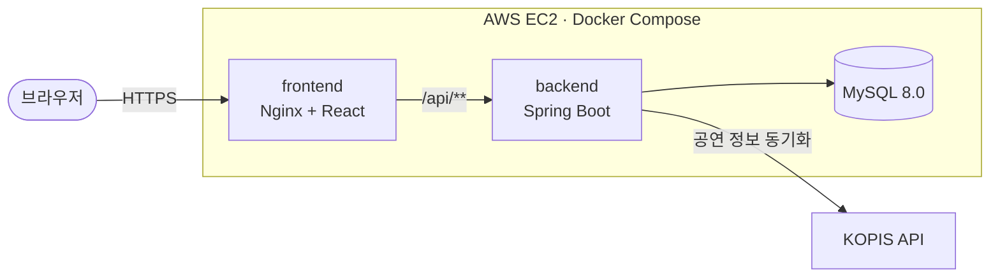

# InMyTicket

[](https://github.com/dongri-p/InMyTicket_JPA/actions/workflows/ci.yml)

실제 공연 정보로 좌석을 고르고 예매·결제까지 해볼 수 있는 티켓 예매 사이트입니다.
여러 명이 같은 좌석을 동시에 눌러도 한 명만 예매되도록 만드는 데 가장 공을 들였고,
서버도 직접 구축해서 배포·운영하고 있습니다.

**데모: https://inmyticket.duckdns.org**

로그인 화면의 "체험 계정으로 둘러보기" 버튼을 누르면 가입 없이 바로 써볼 수 있습니다. 결제는 실제로 청구되지 않는 가상 결제입니다.

| 공연 목록 | 좌석 선택 | 내 예매 목록 |
| --- | --- | --- |
|  |  |  |

| 저장소 | 내용 |
| --- | --- |
| [InMyTicket_JPA](https://github.com/dongri-p/InMyTicket_JPA) (여기) | Spring Boot 백엔드 |
| [InMyTicket_JPA_frontend](https://github.com/dongri-p/InMyTicket_JPA_frontend) | React 프론트엔드 |
| [InMyTicket_deploy](https://github.com/dongri-p/InMyTicket_deploy) | docker-compose, nginx 설정 |

## 무엇을 할 수 있나요

- KOPIS(공연예술통합전산망) Open API에서 실제 공연 정보를 받아와 보여줍니다.
- 회차를 고르고 좌석을 선택해 예매합니다. 결제하지 않고 10분이 지나면 좌석은 자동으로 풀립니다.
- 가상 PG로 결제하고, 마이페이지에서 취소하면 환불까지 처리됩니다.
- 로그인은 JWT로 처리합니다.

## 기술 스택

- **Backend**: Java 17, Spring Boot 3.5, Spring Data JPA, Spring Security + JWT, Flyway
- **DB**: MySQL 8.0 (운영), H2 (로컬·테스트)
- **Frontend**: React 19, Vite
- **Infra**: AWS EC2, Docker Compose, Nginx, Let's Encrypt, GitHub Actions, GHCR

## 구조

EC2 한 대에서 컨테이너 3개(nginx+프론트, 백엔드, MySQL)를 띄웠습니다. 외부에는 80/443만 열려 있고, 백엔드와 DB는 밖에서 직접 접근할 수 없습니다.



`main`에 push하면 GitHub Actions가 테스트 → 이미지 빌드(GHCR) → EC2 배포까지 이어서 진행합니다. 처음엔 EC2(RAM 1GB)에서 직접 빌드했는데, 빌드된 이미지를 받아오기만 하도록 바꾸면서 배포 단계가 2분 10초에서 25초 정도로 줄었습니다.

## 고민했던 문제들

각 항목의 자세한 과정은 [docs/problem-solving.md](docs/problem-solving.md)에 정리했습니다.

**1. 같은 좌석 동시 예매**
좌석을 조회할 때 비관적 락(`SELECT ... FOR UPDATE`)을 걸어 한 좌석은 한 요청만 차지할 수 있게 했고, 회차의 잔여석 수는 원자적 UPDATE로 줄입니다. 한 좌석에 예매 요청 100개를 동시에 보내는 테스트에서 성공은 정확히 1건이었습니다. (이 테스트는 아직 H2 기준입니다.)

**2. 결제 통신 동안 DB 커넥션을 붙잡고 있는 문제**
PG 승인 통신(약 1.5초)이 트랜잭션 안에 있으면 그동안 커넥션을 계속 쥐고 있게 됩니다. 통신은 트랜잭션 밖에서 하고, 결과를 저장하는 부분만 짧은 트랜잭션으로 분리했습니다. 로컬에서 측정해보니 결제 1건당 커넥션 점유 시간이 평균 약 1,517ms에서 3ms 안팎으로 줄었습니다.

**3. PG 승인은 됐는데 DB 저장이 실패하면?**
2번처럼 나누고 나니 "돈은 빠져나갔는데 결제 기록이 없는" 경우가 생길 수 있었습니다. DB 반영이 실패하면 PG에 승인 취소를 보내는 보상 처리를 넣었습니다. 보상이 실패하면 수동 환불이 필요하다는 로그를 남기고, 이미 다른 결제에 쓰인 결제 키는 남의 결제를 환불하지 않도록 보상을 건너뜁니다.

**4. 결제 중인 예약의 상태 관리**
결제 중에 자동 만료 스케줄러가 좌석을 회수해버리지 않도록 `PROCESSING` 상태를 두었습니다. 그런데 PG 통신 도중 서버가 죽으면 이 상태에서 영원히 빠져나오지 못했습니다. 그래서 결제 시작 시각을 기록해두고, 5분이 지나도 `PROCESSING`이면 스케줄러가 `PENDING`으로 되돌리게 했습니다.

**5. 결제와 취소가 동시에 들어올 때**
락 없이 둘이 같은 예약을 수정하면 "결제는 완료인데 좌석은 반환된" 상태가 생겼습니다. 예약에도 비관적 락을 걸어 순서대로 처리되게 했습니다. 그리고 소유자 확인보다 환불 통신이 먼저 나가던 순서도 바로잡았습니다.

**6. 로그인 보안**
아이디가 없을 때와 비밀번호가 틀렸을 때 메시지와 응답 시간이 달라서 계정이 있는지 알아낼 수 있었습니다. 둘을 똑같이 맞췄습니다. 5회 실패 잠금은 (아이디, IP) 기준인데, nginx 뒤라서 모든 요청의 IP가 nginx로 찍히고 있었습니다. 이걸 그대로 두면 누구든 남의 계정을 잠글 수 있어서, 신뢰하는 프록시의 `X-Forwarded-For`만 읽도록 설정했습니다.

**7. N+1 쿼리**
회차 목록을 조회할 때 공연·공연장을 회차마다 따로 조회하고 있었습니다. 페치 조인으로 쿼리 1번에 가져오도록 바꿨습니다.

## 배포하면서 겪은 문제

EC2(t2.micro)에 올리면서 겪은 일들입니다. 자세한 내용은 [docs/deployment-troubleshooting.md](docs/deployment-troubleshooting.md)에 있습니다.

- HTTP로 배포했더니 결제 화면이 흰 화면이 됨 → `crypto.randomUUID()`가 HTTPS에서만 동작해서였고, 도메인과 인증서를 붙여 HTTPS로 전환
- 메모리·디스크 부족으로 빌드 실패 → 스왑 추가, EBS 확장, 이후 빌드를 GitHub Actions로 이전
- 재시작하면 IP가 바뀌어 접속 불가 → Elastic IP 할당
- 백엔드만 재배포하면 502 → nginx가 백엔드 주소를 처음 한 번만 조회해서였고, 도커 DNS로 요청마다 다시 조회하게 변경
- `.env`를 바꿔도 관리자 비밀번호가 안 바뀜 → 기동 시 비교해서 갱신
- 백엔드 8080 포트가 외부에 열려 있었음 → 포트 매핑과 보안 그룹 규칙 제거
- 회차 시간이 DB에 9시간 밀려 저장됨 → JVM 타임존을 Asia/Seoul로 맞추고 밀린 데이터 보정

## 아직 부족한 점

- 동시성 테스트를 H2에서만 돌렸습니다. MySQL과 H2는 락 동작이 달라서 Testcontainers로 MySQL 기준 테스트를 추가하려고 합니다.
- 2번의 커넥션 점유 시간은 단건 측정입니다. 부하 테스트(k6 등)로 동시 요청 상황에서 비교해보지는 않았습니다.
- PG는 시뮬레이션입니다. 실제 PG라면 서버 재시작 후 복구할 때 PG 거래 조회로 승인 여부를 확인해야 하는데, 지금은 결제 기록이 없으면 미승인으로 봅니다.
- 좌석은 비관적 락으로 지키고 있어서 `@Version`(낙관적 락)이 실제로 막아주는 경로는 지금 없습니다. 락 없이 좌석을 바꾸는 코드가 생길 때를 대비한 안전장치 정도입니다.
- 로그인 잠금은 서버 메모리에 저장해서 재시작하면 초기화되고, 여러 IP로 나눠서 하는 공격은 막지 못합니다.
- 배포할 때 백엔드가 뜨는 20초 정도는 API가 502를 반환합니다. DB 백업은 도커 볼륨뿐이고, 모니터링은 `docker logs`로 보는 수준입니다.

<details>
<summary>API 목록</summary>

| Method | URL | 설명 | 권한 |
| --- | --- | --- | --- |
| POST | `/api/v1/members` | 회원가입 | 전체 |
| POST | `/api/v1/members/login` | 로그인 (JWT 발급) | 전체 |
| GET | `/api/v1/performances` | 공연 목록 (페이징) | 전체 |
| GET | `/api/v1/performances/{id}` | 공연 상세 | 전체 |
| GET | `/api/v1/performances/{performanceId}/schedules` | 공연별 회차 목록 | 전체 |
| GET | `/api/v1/schedules/{scheduleId}/seats` | 회차별 좌석 현황 | 전체 |
| POST | `/api/v1/reservations` | 좌석 예매 | 회원 |
| GET | `/api/v1/reservations/me` | 내 예매 목록 | 회원 |
| DELETE | `/api/v1/reservations/{reservationId}` | 예매 취소 (결제 건은 환불) | 회원 |
| POST | `/api/v1/payments` | 결제 승인 | 회원 |
| POST | `/api/v1/performances/sync` | KOPIS 공연 정보 동기화 | 관리자 |
| POST | `/api/v1/halls` | 공연장 등록 | 관리자 |
| POST | `/api/v1/schedules` | 회차 등록 | 관리자 |

</details>

<details>
<summary>패키지 구조</summary>

```text
src/main/java/com/example/dongri/inmyticket
├── api          # 컨트롤러, 요청/응답 DTO
├── config       # Security, JWT, 초기 데이터
├── domain       # Member, Performance, Schedule, Seat, Reservation, Payment
├── external     # KOPIS API, PG 연동(시뮬레이션)
├── repository   # Spring Data JPA
└── service      # 비즈니스 로직, 트랜잭션 경계
```

</details>
