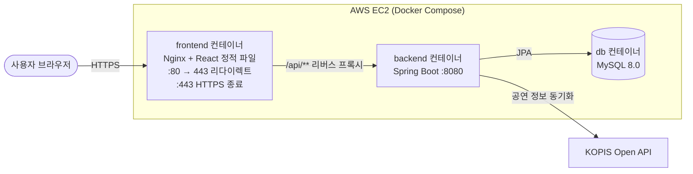

# InMyTicket (실시간 티켓 예매 및 고도화 프로젝트)

이 프로젝트는 동시 요청이 몰리는 실시간 티켓 예매 시스템의 특성을 고려하여
데이터 처리 성능을 최적화하고 복잡한 동시성 이슈 및 인프라 고갈 문제를 해결하는 데 초점을 맞춘 백엔드 프로젝트입니다.

* **데모:** https://inmyticket.duckdns.org (회원가입 후 로그인하면 공연 목록 → 회차/좌석 선택 → 예매 → 결제까지 이용할 수 있습니다)
* **저장소 구성**

| 저장소 | 역할 |
| --- | --- |
| [InMyTicket_JPA](https://github.com/dongri-p/InMyTicket_JPA) (현재) | Spring Boot 백엔드 API |
| [InMyTicket_JPA_frontend](https://github.com/dongri-p/InMyTicket_JPA_frontend) | React(Vite) 프론트엔드 |
| [InMyTicket_deploy](https://github.com/dongri-p/InMyTicket_deploy) | docker-compose, 배포용 nginx(HTTPS) 설정 |

---

## 1. 프로젝트 개요
* **프로젝트명:** InMyTicket (인마이티켓)
* **주요 기능:**
  * KOPIS(공연예술통합전산망) Open API로 실제 공연 정보를 동기화하고, 공연 및 회차 정보를 조회 (N+1 최적화 적용)
  * 다중 사용자의 실시간 좌석 선점 및 예매 프로세스 (동시성 제어 적용)
  * 미결제 예약 자동 만료 스케줄러
  * 가상 PG 결제 승인/환불 처리 (외부 통신 지연 1.5초를 시뮬레이션, 커넥션 풀 보호 적용)
  * Spring Security + JWT 기반의 무상태(Stateless) 회원 인증 시스템

---

## 2. 기술 스택 (Tech Stack)
* **Backend Core:** Java 17, Spring Boot 3.5
* **Data Access:** Spring Data JPA, Hibernate, Flyway (운영 DB 스키마 버전 관리)
* **Database:** H2 (로컬 개발/테스트), MySQL 8.0 (운영)
* **Security & Auth:** Spring Security, JWT (jjwt)
* **Frontend:** React 19, Vite, React Router, Axios
* **Infra:** AWS EC2 (Ubuntu), Docker / Docker Compose, Nginx (리버스 프록시), Let's Encrypt (HTTPS)
* **Testing & Tools:** JUnit 5, Postman

---

## 3. 시스템 아키텍처 및 구조 (Structure)

### 배포 아키텍처
EC2 한 대에서 Docker Compose로 3개 컨테이너를 띄웁니다. 외부에는 80/443만 열려 있고, 백엔드(8080)와 DB는 외부에 노출하지 않습니다.



* 프론트엔드와 API가 같은 도메인(`https://inmyticket.duckdns.org`)을 쓰고, `/api/` 요청만 Nginx가 내부 네트워크의 `backend:8080`으로 넘깁니다.
* 인증서는 EC2 호스트의 certbot이 발급·자동 갱신하고, Nginx 컨테이너에는 읽기 전용으로 마운트합니다.
* 비밀값(DB 비밀번호, JWT 시크릿, KOPIS 키 등)은 저장소에 올리지 않고 EC2의 `.env` 파일로만 주입합니다.

### 프로젝트 패키지 구조
도메인 중심 설계 및 REST API 최적화 규격을 준수하여 레이어를 엄격히 분리했습니다.
```text
src/main/java/com/example/dongri/inmyticket
├── api             # REST API 컨트롤러 및 Request/Response DTO 레이어
├── config          # Spring Security, JWT 등 전역 설정 레이어
├── domain          # Member, Performance, Schedule, Seat, Reservation, Payment 등 핵심 엔티티 및 Enum
├── external        # KOPIS Open API 연동 클라이언트
├── repository      # Spring Data JPA 기반 데이터 접근 레이어
└── service         # 트랜잭션 경계 및 핵심 비즈니스 로직 레이어

[Client] ──(JWT 토큰 포함 요청)──> [Spring Security Filter Chain]
                                          │ (토큰 검증 완료)
                                          ▼
[ApiController] <──(인증 객체 주입)── [SecurityContext]
        │
        ▼
[Service] ───(트랜잭션 / 비즈니스 검증)───> [Repository] ───> [DB]
```

### 주요 API
| Method | URL | 설명 | 권한 |
| --- | --- | --- | --- |
| POST | `/api/v1/members` | 회원가입 | 전체 |
| POST | `/api/v1/members/login` | 로그인 (JWT 발급) | 전체 |
| GET | `/api/v1/performances` | 공연 목록 (페이징) | 전체 |
| GET | `/api/v1/performances/{id}` | 공연 상세 | 전체 |
| GET | `/api/v1/performances/{performanceId}/schedules` | 공연별 회차 목록 | 전체 |
| GET | `/api/v1/schedules/{scheduleId}/seats` | 회차별 좌석 현황 | 전체 |
| POST | `/api/v1/reservations` | 좌석 예매 (선점) | 회원 |
| GET | `/api/v1/reservations/me` | 내 예매 목록 | 회원 |
| DELETE | `/api/v1/reservations/{reservationId}` | 예매 취소 (결제 건은 환불) | 회원 |
| POST | `/api/v1/payments` | 결제 승인 | 회원 |
| POST | `/api/v1/performances/sync` | KOPIS 공연 정보 동기화 | 관리자 |
| POST | `/api/v1/halls` | 공연장 등록 | 관리자 |
| POST | `/api/v1/schedules` | 회차 등록 | 관리자 |

---------

## 4. 핵심 문제 해결 경험

### 1) 연관 엔티티 조회 성능 최적화 (N+1문제 해결)
* **문제정의**: 특정 공연의 회차 리스트를 조회하는 과정에서 연관된 공연 및 공연장 엔티티가 루프를 돌며 개별적으로 조회되는 **N+1 부하 현상**을 발견했습니다.
* **해결방안**: **지연 로딩**을 기본으로 유지하되, 다중 연관관계 조회가 필요한 시점에는 **페치 조인**을 적용하여 1번의 쿼리로 연관 데이터를 무결하게 통합 조회하도록 SQL을 최적화했습니다.
* **성과**: 하위 엔티티 조회 쿼리를 **N+1건에서 단 1건으로 완전히 압축**하여 불필요한 네트워크 오버헤드를 줄이고 데이터베이스 조회 성능을 개선했습니다.

### 2) 가상 좌석 선점 동시성 제어 (더블 부킹 방지)
* **문제정의**: 인기 공연 예매 시 수백 명의 사용자가 단 하나의 남은 좌석을 향해 동시에 예매를 시도할 경우, 동일한 좌석이 중복 선점되는 **더블 부킹 리스크**가 존재했습니다.
* **해결방안**: 좌석 조회 시 데이터베이스 로우 수준에서 쓰기 잠금을 획득하는 **비관적 락**을 기본 방어선으로 적용했습니다. 여기에 **@Version 기반 낙관적 락**을 병합해, 락을 거치지 않는 경로에서도 변경을 감지 할
수 있도록 이중화 했습니다. 또한 회차의 잔여 좌석 수는 별도 락 없이 **원자적 UPDATE**로 갱신해, 데이터 성격에 맞는 방식으로 정합성을 확보했습니다
* **검증**: 
  * 자바의 **`ExecutorService`**와 **`CountDownLatch`**를 활용하여 **"동시에 100명이 1개의 좌석에 티켓팅을 시도하는 극한의 동시성 테스트 환경"**을 구축했습니다.
  * 테스트 수행 결과, **정확히 1명의 요청만 예매에 성공**하고 나머지 99명의 동시 요청은 비즈니스 예외 및 락 제어를 통해 안전하게 차단됨을 데이터베이스 수준에서 검증했습니다.

### 3) 외부 결제 API 연동 시 DB 커넥션 고갈 방지 (외-내-외 전략)
* **문제정의**: 외부 PG사 결제 승인 API를 `@Transactional` 내부에서 호출할 경우, 외부 서버의 네트워크 응답 지연 시간(평균 1.5초) 동안 애플리케이션이 **DB 커넥션을 반환하지 않고 독점하는 커넥션 풀 고갈 장애**가 발생할 위험을 인지했습니다.
* **해결방안**: 트랜잭션의 수명을 분리하는 **'외-내-외(외부 통신 -> 내부 트랜잭션 -> 외부 결과 반환)'** 아키텍처를 설계했습니다.
  * **`PaymentService` (Non-Transactional)**: 외부 PG사 승인 API와 1.5초간 네트워크 통신을 전담하며, 이 비효율적인 시간 동안 **DB 커넥션을 획득하지 않고 대기**합니다.
  * **`PaymentApprovalService` (Transactional)**: 외부 통신이 완벽히 성공한 찰나의 순간에만 **순간적으로 트랜잭션을 실행**하여 DB에 결제 정보를 저장하고 예매 상태를 확정(Update)한 뒤, **커넥션을 즉시 풀에 반환**합니다.
* **성과**: 외부 PG사 서버의 지연이나 장애 확산으로부터 본 서버의 핵심 자원인 **데이터베이스 커넥션 풀을 완벽하게 격리 및 보호**하도록 구조적인 안정성을 확보했습니다.

### 4) 결제-취소 동시성 레이스 및 인가 순서 결함 해결
* **문제정의**: 예약 취소와 결제 승인이 락 없이 동일 예약 엔티티를 동시에 수정할 경우, **결제는 완료됐지만 좌석은 반환된 상태로 남는 데이터 불일치(lost update)**가 발생할 수 있었습니다. 또한 취소 처리 과정에서 **소유권 검증보다 PG 환불 통신이 먼저 실행**되는 순서 결함이 있어, 타인의 예약 ID를 아는 인증된 사용자가 취소를 시도하면 403으로 거부되기 전에 환불 요청이 먼저 나갈 위험이 있었습니다.
* **해결방안**: `Reservation` 엔티티에 비관적 락을 도입해 취소·승인 두 흐름이 동일 예약을 안전하게 순차 처리하도록 하고, 환불 필요 여부를 판단하는 시점을 소유권 검증 **이후**로 재배치했습니다.
* **검증**: 락을 제거한 상태에서는 5회 연속 재현되던 레이스 컨디션이, 적용 후에는 `ExecutorService` 기반 동시 실행 테스트로 재현되지 않음을 확인했습니다.

### 5) 결제 확정과 자동 만료 스케줄러 간 경쟁 상태 방지
* **문제정의**: PG 결제 승인 통신(약 1.5초)이 진행되는 동안, 미결제 좌석을 자동 회수하는 스케줄러가 같은 예약을 먼저 만료시켜버리면 **PG 승인은 성공했는데 결제 기록도 좌석도 없어지는 보상 불가능한 상황**이 발생할 수 있었습니다.
* **해결방안**: 예약 상태에 `PROCESSING`을 추가해 PG 통신 중인 예약을 스케줄러 대상에서 제외하고, 통신 실패 시에는 `PENDING`으로 롤백해 재시도 또는 정상적인 자동 만료가 가능하도록 처리했습니다.

### 6) 로그인 보안 강화 (계정 존재 여부 추론 차단 + 잠금 DoS 방지)
* **문제정의**: 로그인 실패 메시지가 "아이디 없음"과 "비밀번호 불일치"로 서로 달라 **계정 존재 여부를 추론**할 수 있었고, 응답 시간 차이로도 같은 정보가 새는 타이밍 사이드채널이 있었습니다. 또한 단순 실패 횟수 기반 계정 잠금은 공격자가 **피해자 아이디로 틀린 비밀번호를 반복 전송해 정상 사용자 계정을 잠그는 lockout DoS**에 취약했습니다.
* **해결방안**: 에러 메시지를 통일하고, 계정이 존재하지 않아도 더미 해시로 동일한 BCrypt 연산을 수행해 응답 시간을 균일화했습니다. 로그인 시도 잠금의 키를 아이디 단독이 아닌 **(아이디, 클라이언트 IP) 조합**으로 변경해 특정 계정만 노려 잠그는 공격을 차단했습니다.

### 7) 다각도 자체 코드 리뷰를 통한 지속적 품질 개선
* 기능 구현 이후에도 도메인/서비스, API/보안, 크로스 파일 일관성, 코드 정리 관점의 리뷰를 반복 수행하며 코드베이스를 점진적으로 검증·보완했습니다.
* 이 과정에서 위 4)~6)번과 같이 **단위 테스트만으로는 드러나지 않는 동시성 레이스, 인가 순서 결함, 사이드채널 취약점**을 다수 발견해 수정했으며, 매 수정마다 실제 로컬 DB 환경에서 테스트를 실행해 회귀 여부를 검증했습니다.

---------

## 5. 배포 과정 트러블슈팅

로컬에서는 잘 되던 것들이 실제 서버(EC2 t2.micro, HTTP → HTTPS 전환)에 올리면서 드러난 문제들입니다.

### 1) HTTP 배포 환경에서 결제 화면이 흰 화면으로 깨짐
* **문제정의**: 로컬에서는 정상이던 결제 화면이 IP 주소(HTTP)로 배포한 뒤에는 흰 화면만 떴습니다. 원인은 결제 키 생성에 쓴 `crypto.randomUUID()`가 **보안 컨텍스트(HTTPS 또는 localhost)에서만 제공되는 API**라 HTTP 환경에서는 `undefined`였고, `useEffect` 안에서 발생한 TypeError로 React 루트 전체가 언마운트된 것이었습니다.
* **해결방안**: 즉시 조치로 `crypto.getRandomValues()` 기반 폴백을 둔 키 생성 함수로 교체했고, 근본적으로는 도메인(DuckDNS)과 Let's Encrypt 인증서를 적용해 서비스 전체를 HTTPS로 전환했습니다.

### 2) 작은 인스턴스(t2.micro, 1GB RAM)에서의 메모리·디스크 부족
* **문제정의**: 백엔드·프론트·MySQL 3개 컨테이너를 한 대에서 빌드/실행하자 메모리 부족으로 빌드가 중단되거나 백엔드가 뜨지 못했고, 이미지 재빌드가 반복되면서 `ENOSPC`(디스크 공간 부족)로 빌드가 실패했습니다.
* **해결방안**: 스왑 메모리를 추가해 OOM을 막고, EBS 볼륨을 20GiB로 확장(`growpart` + `resize2fs`)했습니다. 또한 프론트만 바꿨을 때는 `docker compose build frontend` 후 `up -d --no-deps frontend`로 **바뀐 서비스만 재빌드**하도록 배포 절차를 정리했습니다(`depends_on` 때문에 그냥 `up --build frontend`를 하면 백엔드까지 빌드됨).

### 3) 인스턴스 재시작 후 SSH 접속 불가
* **문제정의**: 인스턴스를 재시작한 뒤 SSH 접속이 끊겨 보안 그룹부터 의심했지만, 실제 원인은 **퍼블릭 IP가 재시작 때마다 바뀌는 것**이었습니다. IP가 바뀌면 CORS 허용 Origin, 프론트 빌드에 들어간 API 주소도 함께 틀어집니다.
* **해결방안**: Elastic IP를 할당해 주소를 고정하고, 그 IP에 도메인을 연결했습니다.

### 4) 백엔드 컨테이너만 재생성하면 502 Bad Gateway
* **문제정의**: 백엔드만 다시 띄우면 사이트는 열리는데 API가 모두 502로 실패했습니다. Nginx는 `proxy_pass http://backend:8080`의 호스트명을 **기동 시점에 한 번만 DNS 조회**해 캐시하므로, 백엔드 컨테이너가 새 내부 IP로 바뀌어도 예전 IP로 계속 요청을 보내고 있었습니다.
* **해결방안**: 백엔드를 재생성한 뒤에는 frontend(Nginx) 컨테이너도 재시작하도록 배포 절차에 반영했습니다.

### 5) 환경변수를 바꿔도 관리자 비밀번호가 바뀌지 않음
* **문제정의**: 관리자 계정은 기동 시 `ADMIN_PASSWORD` 환경변수로 생성되는데, 이미 계정이 있으면 생성을 건너뛰는 구조라 운영 중 `.env`를 바꿔도 DB의 비밀번호 해시는 그대로였습니다.
* **해결방안**: 기동 시 저장된 해시와 환경변수 값을 비교해, 다르면 해시를 갱신하도록 초기화 로직을 수정하고 단위 테스트로 검증했습니다. 이제 `.env` 변경 후 백엔드 재기동만으로 비밀번호를 교체할 수 있습니다.

### 6) 불필요한 포트 노출 정리
* **문제정의**: HTTPS와 리버스 프록시를 적용한 뒤에도 백엔드 8080 포트가 외부에 열려 있어, Nginx를 거치지 않고 API에 직접 접근할 수 있었습니다.
* **해결방안**: compose에서 백엔드의 포트 매핑을 제거하고 보안 그룹 8080 규칙을 삭제했습니다. 현재 인바운드는 22(SSH), 80, 443만 허용합니다.
